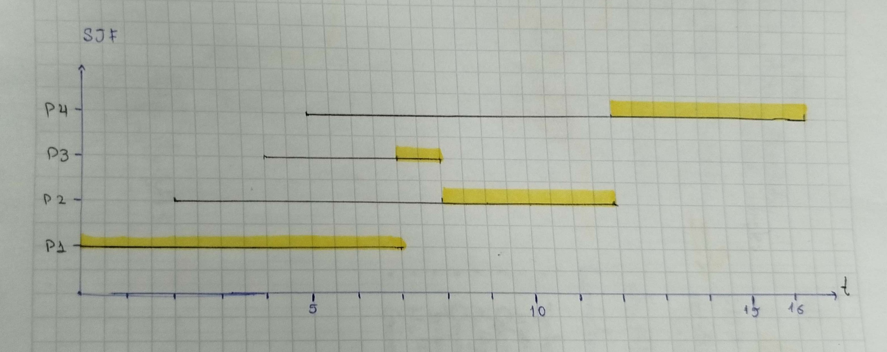

# Bitácora — Planificación de procesos

**Autor:** Eddy Sánchez Obando <eddsysanchez@uncauca.edu.co>

Esta bitácora cubre las dos partes del trabajo: la resolución en papel del
conjunto de procesos P1–P4 (taller de la sesión 6), y el proyecto de código
`src/planificador.cpp`, donde se implementaron los cuatro algoritmos.

> **TE** (tiempo de espera) = tiempo que el proceso pasa en la cola de
> listos, sin usar el procesador. **TR** (tiempo de retorno) = Finalización
> − Llegada (sí incluye la ejecución). Se cumple TE = TR − Ráfaga.

Conjunto de procesos:

| Proceso | Llegada | Ráfaga |
|---|---|---|
| P1 | 0 | 7 |
| P2 | 2 | 4 |
| P3 | 4 | 1 |
| P4 | 5 | 4 |

## Parte 1

### Diagramas de Gantt y tablas de tiempos

#### FIFO

| Proceso | Llegada | Ráfaga | Espera | Retorno |
|---|---|---|---|---|
| P1 | 0 | 7 | 0 | 7 |
| P2 | 2 | 4 | 5 | 9 |
| P3 | 4 | 1 | 7 | 8 |
| P4 | 5 | 4 | 7 | 11 |

Promedio espera = **4.75** — Promedio retorno = **8.75**

#### SJF no expropiativo

En t=7 compiten P2, P3 y P4; gana P3 por tener la ráfaga más corta. En t=8
empatan P2 y P4 con ráfaga 4; el desempate lo decide el orden de llegada, y
P2 llegó primero.

| Proceso | Llegada | Ráfaga | Espera | Retorno |
|---|---|---|---|---|
| P1 | 0 | 7 | 0 | 7 |
| P3 | 4 | 1 | 3 | 4 |
| P2 | 2 | 4 | 6 | 10 |
| P4 | 5 | 4 | 7 | 11 |

Promedio espera = **4.0** — Promedio retorno = **8.0**

#### Round Robin, quantum = 2

| Proceso | Llegada | Ráfaga | Espera | Retorno |
|---|---|---|---|---|
| P1 | 0 | 7 | 9 | 16 |
| P2 | 2 | 4 | 3 | 7 |
| P3 | 4 | 1 | 2 | 3 |
| P4 | 5 | 4 | 6 | 10 |

Promedio espera = **5.0** — Promedio retorno = **9.0**

#### Round Robin, quantum = 1 y quantum = 8

- **Quantum = 1**: promedio espera = 5.5, promedio retorno = 9.5.
- **Quantum = 8**: como ningún proceso tiene ráfaga mayor a 8, ninguno se
  expropia nunca → resultado idéntico a FIFO (promedio espera = 4.75).

### Tabla resumen (papel)

| Algoritmo | Espera promedio | Retorno promedio |
|---|---|---|
| FIFO | 4.75 | 8.75 |
| SJF no expropiativo | 4.0 | 8.0 |
| RR (q=2) | 5.0 | 9.0 |
| RR (q=1) | 5.5 | 9.5 |
| RR (q=8) | 4.75 (= FIFO) | 8.75 (= FIFO) |

### Respuestas

**Punto 3.** El menor tiempo de espera promedio lo da **SJF (4.0)**. No se
puede usar tal cual en un sistema real por dos motivos: primero, el
planificador no conoce de antemano la ráfaga de un proceso, solo la
*estima* (por ejemplo con promedio exponencial de ráfagas anteriores), así
que el algoritmo real deja de ser SJF puro; segundo, al no ser
expropiativo, un proceso largo puede sufrir inanición si no dejan de llegar
procesos cortos que se cuelan siempre delante de él.

**Punto 4.** Con quantum = 1 el planificador se acerca al reparto
simultáneo del procesador ("processor sharing"): cada proceso avanza en
pedacitos muy pequeños, mejorando el tiempo de respuesta percibido, pero a
costa de muchos más cambios de contexto — costo que esta simulación no
modela. Con quantum = 8, como ningún proceso tiene ráfaga mayor a 8,
ninguno llega a agotar su quantum, así que el resultado es **idéntico a
FIFO**: cuando el quantum es mayor o igual que la ráfaga más larga, RR
degenera en FIFO.

**Punto 6.** Al bajar la amabilidad (nice) de un proceso que consume CPU,
en `top`/`ps` cambia la columna `NI` al nuevo valor, y la columna `PR`
(prioridad efectiva del kernel) se ajusta en consecuencia — con nice más
bajo, `PR` baja y el proceso recibe más turnos de CPU frente a los demás.
Lo que **no cambia** es el PID ni el nombre del comando. Ojo con el error
clásico: nice **alto** = proceso más "amable" = **cede** más el procesador
= **menos** prioridad, no más.

## Parte 2 — Proyecto de código (`src/planificador.cpp`)

### Resultados de los cuatro algoritmos

Comprobados con `./planificador test/taller_<algoritmo>.txt` (quantum = 2
en los cuatro casos):

| Algoritmo | Espera promedio obtenida | Esperada (comprobación) |
|---|---|---|
| FIFO | 4.750 | 4.750 |
| SJF (no expropiativo) | 4.000 | 4.000 |
| RR (quantum 2) | 5.000 | 5.000 |
| SRT (expropiativo) | 3.000 | 3.000 |

Las cuatro cifras coinciden exactamente con la comprobación y con la
resolución a mano de la Parte 1. Diagramas generados por el simulador (el
verde representa tiempo de CPU, la barra gris tiempo de espera):

### Qué línea de código distingue a cada algoritmo

Los cuatro algoritmos comparten el mismo bucle en `planificar()`: en cada
vuelta se concede `quantum_asignado = min(quantum, restante)`, se
contabiliza el tiempo, se atienden las llegadas y se reencola si el proceso
no terminó. Lo que varía es **el orden con que entran a la cola**
(`procesar_llegadas`) y **el lugar al que vuelve un proceso interrumpido**
(el `switch`). SRT, además, requiere expropiación.

| Algoritmo | La línea que lo distingue |
|---|---|
| FIFO | Entra por llegada (`push_back`) · reencola con `push_front` (nunca lo interrumpen) |
| SJF | Entra por ráfaga (`insertar_por_restante`) · reencola con `push_front` (no expropia) |
| RR | Entra por llegada (`push_back`) · reencola con **`push_back`** (pierde su lugar) |
| SRT | Entra por ráfaga (`insertar_por_restante`) · reencola con **`insertar_por_restante`** **y** bloque de expropiación |

**Por qué el resultado es el que es:**

- **FIFO** nunca reordena nada: el proceso que llega primero se ejecuta
  primero y, si su quantum no le alcanza, sigue teniendo la CPU en la
  siguiente vuelta (`push_front` lo deja al frente de su propia cola). Por
  eso el orden de ejecución es idéntico al orden de llegada.

- **SJF** entra a la cola ordenado por ráfaga (`insertar_por_restante` en
  `procesar_llegadas`), así que el proceso más corto disponible es siempre
  el primero en tomar la CPU. Como tampoco expropia (`push_front` al
  reencolar), una vez que empieza a ejecutar no lo interrumpe nadie, ni
  siquiera un proceso más corto que llegue después.

- **RR** entra por orden de llegada como FIFO, pero al agotar el quantum
  sin terminar se reencola con `push_back`: pierde su lugar y tiene que
  esperar a que todos los demás listos tomen su turno antes de volver. Esa
  única diferencia (`push_back` en vez de `push_front`) es la que reparte
  la CPU en rodajas entre todos los procesos.

- **SRT** combina el orden por ráfaga de SJF con expropiación real: el
  bloque agregado antes de conceder el quantum revisa las llegadas
  pendientes dentro de la ventana de tiempo, y si alguna trae una ráfaga
  menor que lo que le quedaría al proceso actual en ese instante, corta el
  quantum ahí mismo (`quantum_asignado = transcurrido`) y evita pasar a la
  siguiente cola (`cambiar_de_cola = false`). Por eso P1, que arranca con
  la ráfaga más larga, termina siendo interrumpido en cuanto llega P2 —
  algo que en SJF no pasa porque SJF no revisa llegadas a mitad de turno.

Sin este bloque de expropiación, SRT se comporta exactamente como RR
(ambos reencolan sin terminar de "respetar" la ráfaga más corta), que es
justo la señal que menciona el README para saber si falta implementar algo.